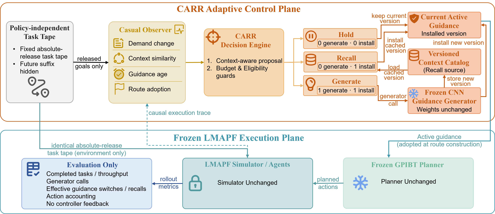
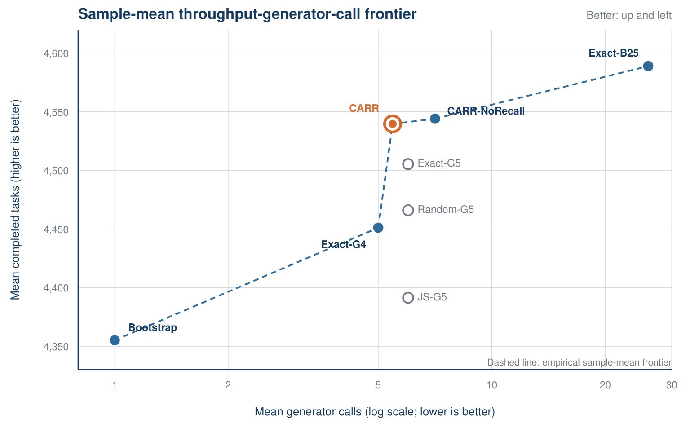
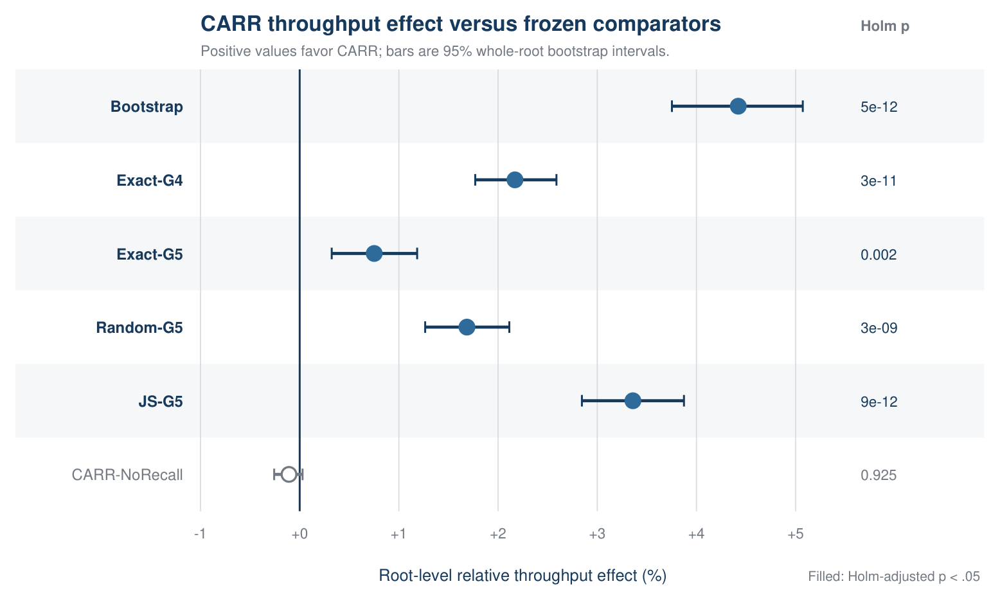

# DAI 2026 Submission — Budgeted Guidance Refresh Control

This repository is the anonymous supplementary artifact for the DAI 2026
submission *Budgeted Guidance Refresh Control: A Paired Throughput–Call Study
in Lifelong Multi-Agent Path Finding*. Its purpose is to give reviewers a direct,
auditable path from the proposed method to the code, the 3,840-run result
table, and every reported numerical conclusion. It is not a manuscript
repository; manuscript sources, author information, and the submitted PDF are
intentionally excluded to preserve double-blind review.

## Repository Structure

```text
CARR/
├── README.md                                      # Artifact overview and reproduction guide
├── pyproject.toml                                 # Package metadata and optional dependencies
├── src/dai_lmapf/                                 # CARR implementation
│   ├── __init__.py                                # Package exports
│   ├── publication_policy.py                      # Hold/recall/generate policy logic
│   ├── same_call_claim_runner.py                  # Causal features, budgets, and safety audit
│   ├── online_ggo_adapter.py                      # Interface to the OnlineGGO simulator
│   ├── frozen_cnn_generator.py                    # Frozen guidance-generator wrapper
│   ├── absolute_workload.py                       # Paired absolute task-tape construction
│   ├── invariants.py                              # MAPF safety invariants
│   ├── protocol.py                                # Scenario and workload contracts
│   └── tasks.py                                   # Released-task validation
├── scripts/                                       # Execution, analysis, and figure scripts
│   ├── run_same_call_confirmation_b.py            # Experiment B entry point
│   ├── run_same_call_confirmation_v1.py           # Full paired experiment runner
│   ├── analyze_compact_b.py                       # Recompute all reported statistics
│   ├── analyze_posthoc_review_sensitivity.py      # Recompute exploratory root bootstraps
│   ├── make_result_figures.py                     # Regenerate result figures
│   ├── make_framework_figure.py                   # Regenerate the CARR framework figure
│   ├── setup_onlineggo.sh                         # Reconstruct the patched backbone
│   └── verify_frozen_cnn_checkpoint.py            # Checkpoint compatibility check
├── configs/
│   └── experiment_b_public.json                   # Public Experiment B design
├── results/same_call_confirmation_b/
│   └── compact_runs.csv                           # Complete 3,840-run result table
├── reports/
│   ├── compact_b_analysis.json                    # Confirmatory statistics and integrity audit
│   └── posthoc_review_sensitivity_2026-08-03.json # Exploratory robustness report
├── carr_rl_lite_exp/                              # Development-only appendix evidence
│   ├── README.md                                  # Scope, provenance, and reproduction notes
│   ├── CONTROLLED_RESOURCE_MEASUREMENT.md          # Post-confirmatory controlled timing boundary
│   ├── ARTIFACT_SHA256.json                       # Checksums for compact appendix evidence
│   ├── scripts/                                   # Learned gate and verification utilities
│   └── results/                                   # Compact summaries and development CSVs
├── assets/                                        # Figures displayed in this README
│   ├── framework.png                              # CARR system architecture
│   ├── pareto_frontier.png                        # Throughput–call Pareto frontier
│   └── superiority_forest.png                     # Paired-effect forest plot
├── patches/                                       # Pinned OnlineGGO modifications
│   ├── onlineggo-local.patch                      # Source-code patch
│   ├── onlineggo_configs/                         # Backbone experiment configurations
│   ├── OnlineGGO-LICENSE                         # Upstream license
│   └── README.md                                  # Patch reconstruction notes
├── tests/                                         # Implementation and result regression tests
│   ├── test_compact_b_artifact.py                 # Exact result reproduction
│   ├── test_publication_policy.py                 # CARR policy contracts
│   ├── test_same_call_claim_runner.py             # Budgets, workloads, and safety checks
│   ├── test_online_ggo_adapter.py                 # Simulator-adapter behavior
│   ├── test_frozen_cnn_generator.py               # Frozen-CNN contract
│   ├── test_run_same_call_confirmation_b.py       # Experiment B control plane
│   ├── test_absolute_workload.py                  # Absolute workload tapes
│   ├── test_invariants.py                         # Joint-transition safety
│   ├── test_protocol.py                           # Scenario protocol
│   └── test_tasks.py                              # Task validation
├── .gitignore                                     # Local/generated artifact exclusions
└── .gitattributes                                 # Cross-platform text/binary attributes
```

The repository contains three complementary evidence layers: the method
implementation under `src/`, the complete compact experimental evidence under
`results/`, and a standalone analysis path under `scripts/` and `reports/`.
The compact analysis requires only Python's standard library; rebuilding the
full simulator additionally requires the patched OnlineGGO backbone and the
trained checkpoint described below.

## Method overview

The proposed resource-aware guidance lifecycle controller, **CARR**, operates
in lifelong multi-agent path finding (LMAPF) and chooses one of three actions
at each decision window:

- **hold** the active guidance;
- **recall** and reinstall compatible guidance generated earlier; or
- **generate** and install new guidance with a frozen CNN.

All evaluated policies use the same task tapes, CNN generator, and GPIBT
planner. Only the guidance lifecycle controller changes. The frozen
implementation uses `reactivate` in operation names, configuration identifiers,
and audit fields; this is the implementation-level name of the action called
**recall** in the paper and this README.

## Main result

The primary 1% non-inferiority objective against dense refresh was **not met**.
The supported conclusion is a sample-mean throughput–generator-call trade-off,
not throughput parity and not a runtime, energy, or global state-of-the-art
claim.

| Comparison | Experiment B result | Interpretation |
|---|---:|---|
| CARR vs. Exact-B25 | -0.8006% paired mean relative effect; 95% whole-root CI [-1.1935%, -0.3966%]; shifted exact p = 0.1693 | All three non-inferiority gates failed |
| Logical generator calls | 5.458 for CARR vs. 26 for Exact-B25 | 79.006% fewer logical calls |
| CARR vs. five low-call comparators | +0.75% to +4.42%; all Holm-adjusted p < 0.002 | Supported paired throughput improvements in the evaluated setting |
| CARR vs. CARR-NoRecall | -0.108%; 95% CI [-0.257%, 0.029%]; Holm p = 0.925 | No supported throughput benefit from recall |
| Mean calls with/without recall | 5.458 vs. 7.073 | Recall descriptively substitutes cached guidance for some fresh generations |

The independent inferential unit is the **root cluster (n = 40)**, not an
individual run row.



## Exploratory appendix evidence

The directory [`carr_rl_lite_exp/`](carr_rl_lite_exp/) contains the additional
development-only and post-hoc checks reported in the appendix: the
development-tuned learned gate, the matched G5 generation-cap comparison,
one-at-a-time threshold sensitivity, logical-call timing diagnostics, and
bootstrap frontier stability. These checks are explicitly separated from the
frozen Experiment B confirmatory matrix. The directory also contains a small,
post-confirmatory [controlled wall-clock microbenchmark](carr_rl_lite_exp/CONTROLLED_RESOURCE_MEASUREMENT.md)
showing why logical generator calls are not a wall-clock or energy proxy on
this small-CNN backbone. These checks neither change the primary estimand nor
enter the six-comparison multiplicity family.

For the learned holdout check, the archived historical report's `6.51 vs
6.50` values are effective post-bootstrap guidance publications, not generator
invocations. The accompanying raw-counter projection records the unambiguous
total generator-call means (`4.83` learned vs `5.38` rule CARR) while retaining
the historical report unchanged for provenance.

Two bootstrap streams are kept separate on purpose:

- `reports/posthoc_review_sensitivity_2026-08-03.json` is the canonical
  `seed=20260803` source for the log-ratio and call-difference sensitivity
  analyses;
- `carr_rl_lite_exp/results/carr_rl_lite/expB_pareto_bootstrap.json` is the
  `seed=20260715` source for the reported 100% CARR non-dominance and 99.97%
  point-dominance frequency against Exact-G5.

The 99.96% value obtained when the frontier check reuses the first stream is a
one-resample Monte-Carlo difference, not a substantive discrepancy. The
submitted number is backed by the dedicated Pareto report above.

## Experimental design

Experiment B is a fully paired matrix:

| Dimension | Value |
|---|---|
| Policies | 8 |
| Independent root clusters | 40 |
| Scenarios | 4 |
| Workloads | stationary, abrupt, recurrent |
| Total runs | 8 × 40 × 4 × 3 = 3,840 |
| Runs per policy | 480 |
| Warm-up / scored horizon | 200 / 2,000 timesteps |
| Decision window | 20 timesteps |

| Scenario | Map | Density | Agents |
|---|---|---:|---:|
| `narrow_r020` | narrow warehouse | 0.20 | 218 |
| `narrow_r035` | narrow warehouse | 0.35 | 382 |
| `regular_r020` | regular warehouse | 0.20 | 255 |
| `regular_r035` | regular warehouse | 0.35 | 447 |

Every scenario–root–workload cell uses the same task-tape, release-projection,
and reset-causal fingerprints across all eight methods. Intervals use 10,000
whole-root bootstrap samples. Superiority tests use exact root-level sign
flips with Holm correction across six comparisons. The primary
non-inferiority test is outside that multiplicity family.

## Method summaries

Boldface identifies the proposed method; it does not indicate the best value in
each column.

| Code name | Display label | Mean completed tasks | Mean logical calls | Median / P90 / max calls |
|---|---|---:|---:|---:|
| `bootstrap_only` | Bootstrap | 4,355.08 | 1.000 | 1 / 1 / 1 |
| `exact_even_G4` | Exact-G4 | 4,451.10 | 5.000 | 5 / 5 / 5 |
| `exact_even_G5` | Exact-G5 | 4,505.35 | 6.000 | 6 / 6 / 6 |
| `random_G5` | Random-G5 | 4,465.94 | 6.000 | 6 / 6 / 6 |
| `js_cap_G5` | JS-G5 | 4,391.32 | 6.000 | 6 / 6 / 6 |
| `exact_even_B25` | Exact-B25 | 4,588.90 | 26.000 | 26 / 26 / 26 |
| `context_no_reactivation_B25` | CARR-NoRecall | 4,544.06 | 7.073 | 7 / 10 / 13 |
| **`context_memory_B25`** | **CARR (ours)** | **4,539.62** | **5.458** | **5 / 8 / 10** |



The sample-mean frontier contains Bootstrap, Exact-G4, CARR-NoRecall, CARR,
and Exact-B25. CARR is not point-dominated, but this does not override the
failed non-inferiority test.



## Core Execution Path

The claim-bearing code path is:

```text
absolute workload tape
  -> OnlineGGO environment adapter
  -> causal observation and invariants
  -> CARR guidance lifecycle controller
       -> hold
       -> recall cached guidance
       -> generate guidance with the frozen CNN
  -> GPIBT planner
  -> completed-task count
```

The corresponding files are
`absolute_workload.py`, `online_ggo_adapter.py`, `invariants.py`,
`publication_policy.py`, `frozen_cnn_generator.py`, and
`same_call_claim_runner.py`.

## Reproduce the reported analysis

The analysis itself requires only Python 3.9 or later and the standard
library:

```bash
python3 scripts/analyze_compact_b.py \
  --output reproduced/compact_b_analysis.json --force
# Optional byte-for-byte check on macOS/Linux:
cmp reproduced/compact_b_analysis.json reports/compact_b_analysis.json
```

The command validates the complete matrix, pairing fingerprints, safety flags,
and generator/switch conservation before recomputing:

- method summaries and call distributions;
- paired root-level effects and bootstrap intervals;
- exact sign-flip tests and Holm correction;
- the three non-inferiority gates; and
- the sample-mean Pareto frontier.

Expected artifact hashes:

| Artifact | SHA-256 |
|---|---|
| `compact_runs.csv` | `223951f30d7ca4f142a5b945cdc1e53ed59ac40ce7d0a19e949f3f4f3bbe626a` |
| `compact_b_analysis.json` | `b675db23a294d2f1becae7f6eb5e231004e883c6f737e131069cc75df9cb22b0` |

The post-hoc root-bootstrap report is independently reproducible:

```bash
python3 scripts/analyze_posthoc_review_sensitivity.py \
  --csv results/same_call_confirmation_b/compact_runs.csv \
  --output reproduced/posthoc_review_sensitivity_2026-08-03.json \
  --seed 20260803 --bootstrap-samples 10000
cmp reproduced/posthoc_review_sensitivity_2026-08-03.json \
  reports/posthoc_review_sensitivity_2026-08-03.json
```

| Exploratory artifact | SHA-256 |
|---|---|
| `analyze_posthoc_review_sensitivity.py` | `854eb256f76c4ad71c020d0807ec04b05a11461c4d1184665abe02338507e67a` |
| `posthoc_review_sensitivity_2026-08-03.json` | `77845872984724a9f8f73e3537e584a17d41aab48b543f6fc7b3161e5e7cf0ea` |

Additional appendix checks and their hashes are validated by
`carr_rl_lite_exp/scripts/verify_public_summaries.py` against
`carr_rl_lite_exp/ARTIFACT_SHA256.json`.

## Tests

```bash
PYTHONDONTWRITEBYTECODE=1 PYTHONPATH=src \
  python3 -m unittest discover -s tests -v
```

The same suite regenerates the development runner from the frozen v1 runner,
checks all compact exploratory summaries against their public CSVs, reproduces
the post-hoc report byte for byte, and scans committed result files for
machine-specific path or host leakage. The exploratory verifier can also be
run directly:

```bash
python3 carr_rl_lite_exp/scripts/verify_public_summaries.py
```

The compact-result regression test can be run separately:

```bash
PYTHONDONTWRITEBYTECODE=1 PYTHONPATH=src \
  python3 -m unittest -v tests.test_compact_b_artifact
```

NumPy and PyTorch are optional and enable the frozen-CNN checks:

```bash
python3 -m pip install -e '.[experiment]'
```

## Regenerate figures

```bash
python3 -m pip install -e '.[figures]'
python3 scripts/make_result_figures.py
python3 scripts/make_framework_figure.py
```

Generated PDFs are written to `reproduced/figures/` and are not tracked.
The PNG files under `assets/` are the reviewer-facing previews included in
this repository.

## Full experiment code

The modified backbone is reconstructed from a pinned upstream OnlineGGO
revision and the patch in `patches/`:

```bash
bash scripts/setup_onlineggo.sh
```

The full experiment entry point is:

```bash
python3 scripts/run_same_call_confirmation_b.py --help
```

A full 3,840-run rerun additionally requires the trained CNN checkpoint and a
native OnlineGGO build. Those large machine-dependent artifacts are not
included here; the portable public design is in
`configs/experiment_b_public.json`. The included compact table and analysis
are sufficient to audit every numerical result reported above.

For portability, the bundled base runner records the public JSON configuration
in its post-run source manifest instead of the retired internal protocol file.
This manifest-path substitution is non-causal: it is not read by the
simulation, workload, guidance lifecycle controller, or random-number streams.

In the public configuration, `standalone_replication` means that Experiment B
is analyzed independently rather than pooled with earlier experiments. It
does not mean that the external checkpoint and native simulator build are
bundled in this repository.

## Result-file scope

`compact_runs.csv` contains outcomes, logical call counts,
generation/reactivation counts, safety flags, and within-cell pairing hashes.
Here `reactivation` is the frozen implementation and audit-field name for the
paper's recall action.
It intentionally contains no author names, hostnames, filesystem paths,
process identifiers, timestamps, or environment fingerprints.

`compact_b_analysis.json` contains the complete computed numerical result.
The compact layer supports result reproduction and matrix-level checks; it
does not replace trace-level inspection of the original simulator logs.
