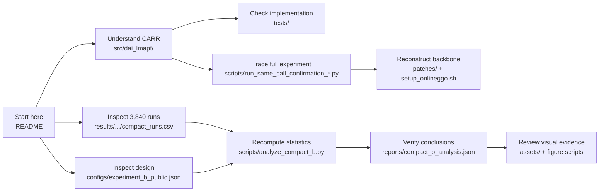

# DAI2026 Submission — When Should Global Guidance Be Refreshed?

## CARR: Anonymous Code and Results Supplement

This repository is the anonymous supplementary artifact for the DAI 2026
submission *When Should Global Guidance Be Refreshed?* Its purpose is to give
reviewers a direct, auditable path from the proposed method to the code, the
3,840-run result table, and every reported numerical conclusion. It is not a
manuscript repository.

The artifact supports three reviewer tasks:

1. **Inspect the implementation:** follow the CARR policy from causal inputs to
   hold, reactivate, and generate actions.
2. **Inspect the evidence:** examine the complete compact Experiment B matrix
   and its within-cell pairing and safety fields.
3. **Recompute the conclusions:** regenerate the committed analysis JSON and
   result figures from the included table.

The proposed adaptive global-guidance publication policy, **CARR**, operates
in lifelong multi-agent path finding (LMAPF) and chooses one of three actions
at each decision window:

- **hold** the active guidance;
- **reactivate** compatible guidance generated earlier; or
- **generate** and install new guidance with a frozen CNN.

All evaluated policies use the same task tapes, CNN generator, and GPIBT
planner. Only the guidance-publication policy changes. Author information,
manuscript sources, build products, machine logs, and unrelated exploratory
experiments are intentionally excluded.

## Main result

The primary 1% non-inferiority objective against dense refresh was **not met**.
The supported conclusion is a sample-mean throughput–generator-call trade-off,
not throughput parity and not a runtime, energy, or global state-of-the-art
claim.

| Comparison | Experiment B result | Interpretation |
|---|---:|---|
| CARR vs. Exact-B25 | -0.8006% paired mean relative effect; 95% whole-root CI [-1.1935%, -0.3966%]; shifted exact p = 0.1693 | All three non-inferiority gates failed |
| Logical generator calls | 5.458 for CARR vs. 26 for Exact-B25 | 79.006% fewer logical calls |
| CARR vs. five low-call comparators | +0.75% to +4.42%; all Holm-adjusted p < 0.002 | Supported paired throughput improvements in the evaluated setting |
| CARR vs. CARR-NoRecall | -0.108%; 95% CI [-0.257%, 0.029%]; Holm p = 0.925 | No supported throughput benefit from recall |
| Mean calls with/without recall | 5.458 vs. 7.073 | Recall descriptively substitutes reactivation for some new generations |

The independent inferential unit is the **root cluster (n = 40)**, not an
individual run row.


## Experimental design

Experiment B is a fully paired matrix:

| Dimension | Value |
|---|---|
| Policies | 8 |
| Independent root clusters | 40 |
| Scenarios | 4 |
| Workloads | stationary, abrupt, recurrent |
| Total runs | 8 × 40 × 4 × 3 = 3,840 |
| Runs per policy | 480 |
| Warm-up / scored horizon | 200 / 2,000 timesteps |
| Decision window | 20 timesteps |

| Scenario | Map | Density | Agents |
|---|---|---:|---:|
| `narrow_r020` | narrow warehouse | 0.20 | 218 |
| `narrow_r035` | narrow warehouse | 0.35 | 382 |
| `regular_r020` | regular warehouse | 0.20 | 255 |
| `regular_r035` | regular warehouse | 0.35 | 447 |

Every scenario–root–workload cell uses the same task-tape, release-projection,
and reset-causal fingerprints across all eight methods. Intervals use 10,000
whole-root bootstrap samples. Superiority tests use exact root-level sign
flips with Holm correction across six comparisons. The primary
non-inferiority test is outside that multiplicity family.

## Method summaries

| Code name | Display label | Mean completed tasks | Mean logical calls | Median / P90 / max calls |
|---|---|---:|---:|---:|
| `bootstrap_only` | Bootstrap | 4,355.08 | 1.000 | 1 / 1 / 1 |
| `exact_even_G4` | Exact-G4 | 4,451.10 | 5.000 | 5 / 5 / 5 |
| `exact_even_G5` | Exact-G5 | 4,505.35 | 6.000 | 6 / 6 / 6 |
| `random_G5` | Random-G5 | 4,465.94 | 6.000 | 6 / 6 / 6 |
| `js_cap_G5` | JS-G5 | 4,391.32 | 6.000 | 6 / 6 / 6 |
| `context_no_reactivation_B25` | CARR-NoRecall | 4,544.06 | 7.073 | 7 / 10 / 13 |
| `context_memory_B25` | CARR | 4,539.62 | 5.458 | 5 / 8 / 10 |
| `exact_even_B25` | Exact-B25 | 4,588.90 | 26.000 | 26 / 26 / 26 |


The sample-mean frontier contains Bootstrap, Exact-G4, CARR-NoRecall, CARR,
and Exact-B25. CARR is not point-dominated, but this does not override the
failed non-inferiority test.


## Repository structure and reviewer path



The upper branch exposes the method and execution code; the lower branch
connects the public experimental design and per-run evidence to the exact
statistics and figures reported in the submission. A reviewer interested only
in numerical verification can follow `README → compact_runs.csv →
analyze_compact_b.py → compact_b_analysis.json` without building the simulator.

Repository contents:

| Path | Contents |
|---|---|
| `src/dai_lmapf/` | CARR policy, workload construction, safety contracts, frozen-CNN wrapper, and OnlineGGO adapter |
| `scripts/run_same_call_confirmation_*.py` | Experiment execution entry points |
| `scripts/analyze_compact_b.py` | Standard-library analysis of the included 3,840-run table |
| `scripts/make_*figure*.py` | Result and framework figure generation |
| `configs/experiment_b_public.json` | Methods, roots, scenarios, workloads, and inferential settings |
| `results/same_call_confirmation_b/compact_runs.csv` | Anonymous per-run experimental results |
| `reports/compact_b_analysis.json` | Machine-readable audit, statistics, tests, and Pareto summary |
| `patches/` | Patch and configuration files for the pinned OnlineGGO backbone |
| `tests/` | Core implementation and result-regression tests |

The claim-bearing code path is:

```text
absolute workload tape
  -> OnlineGGO environment adapter
  -> causal observation and invariants
  -> CARR publication policy
       -> hold
       -> reactivate cached guidance
       -> generate guidance with the frozen CNN
  -> GPIBT planner
  -> completed-task count
```

The corresponding files are
`absolute_workload.py`, `online_ggo_adapter.py`, `invariants.py`,
`publication_policy.py`, `frozen_cnn_generator.py`, and
`same_call_claim_runner.py`.

## Reproduce the reported analysis

The analysis itself requires only Python 3.9 or later and the standard
library:

```bash
python3 scripts/analyze_compact_b.py \
  --output reproduced/compact_b_analysis.json --force
# Optional byte-for-byte check on macOS/Linux:
cmp reproduced/compact_b_analysis.json reports/compact_b_analysis.json
```

The command validates the complete matrix, pairing fingerprints, safety flags,
and generator/publication conservation before recomputing:

- method summaries and call distributions;
- paired root-level effects and bootstrap intervals;
- exact sign-flip tests and Holm correction;
- the three non-inferiority gates; and
- the sample-mean Pareto frontier.

Expected artifact hashes:

| Artifact | SHA-256 |
|---|---|
| `compact_runs.csv` | `223951f30d7ca4f142a5b945cdc1e53ed59ac40ce7d0a19e949f3f4f3bbe626a` |
| `compact_b_analysis.json` | `b675db23a294d2f1becae7f6eb5e231004e883c6f737e131069cc75df9cb22b0` |

## Tests

```bash
PYTHONDONTWRITEBYTECODE=1 PYTHONPATH=src \
  python3 -m unittest discover -s tests -v
```

The compact-result regression test can be run separately:

```bash
PYTHONDONTWRITEBYTECODE=1 PYTHONPATH=src \
  python3 -m unittest -v tests.test_compact_b_artifact
```

NumPy and PyTorch are optional and enable the frozen-CNN checks:

```bash
python3 -m pip install -e '.[experiment]'
```

## Regenerate figures

```bash
python3 -m pip install -e '.[figures]'
python3 scripts/make_result_figures.py
python3 scripts/make_framework_figure.py
```

Generated PDFs are written to `reproduced/figures/` and are not tracked.
The PNG files under `assets/` are the reviewer-facing previews included in
this repository.

## Full experiment code

The modified backbone is reconstructed from a pinned upstream OnlineGGO
revision and the patch in `patches/`:

```bash
bash scripts/setup_onlineggo.sh
```

The full experiment entry point is:

```bash
python3 scripts/run_same_call_confirmation_b.py --help
```

A full 3,840-run rerun additionally requires the trained CNN checkpoint and a
native OnlineGGO build. Those large machine-dependent artifacts are not
included here; the portable public design is in
`configs/experiment_b_public.json`. The included compact table and analysis
are sufficient to audit every numerical result reported above.

For portability, the bundled base runner records the public JSON configuration
in its post-run source manifest instead of the retired internal protocol file.
This manifest-path substitution is non-causal: it is not read by the
simulation, workload, publication policy, or random-number streams.

In the public configuration, `standalone_replication` means that Experiment B
is analyzed independently rather than pooled with earlier experiments. It
does not mean that the external checkpoint and native simulator build are
bundled in this repository.

## Result-file scope

`compact_runs.csv` contains outcomes, logical call counts,
generation/reactivation counts, safety flags, and within-cell pairing hashes.
It intentionally contains no author names, hostnames, filesystem paths,
process identifiers, timestamps, or environment fingerprints.

`compact_b_analysis.json` contains the complete computed numerical result.
The compact layer supports result reproduction and matrix-level checks; it
does not replace trace-level inspection of the original simulator logs.
